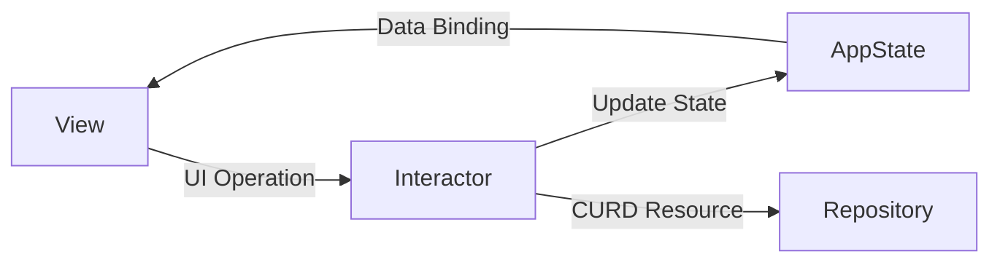
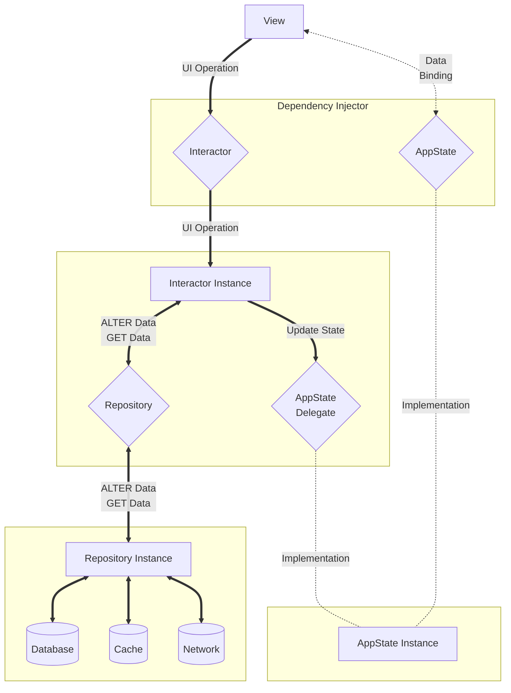
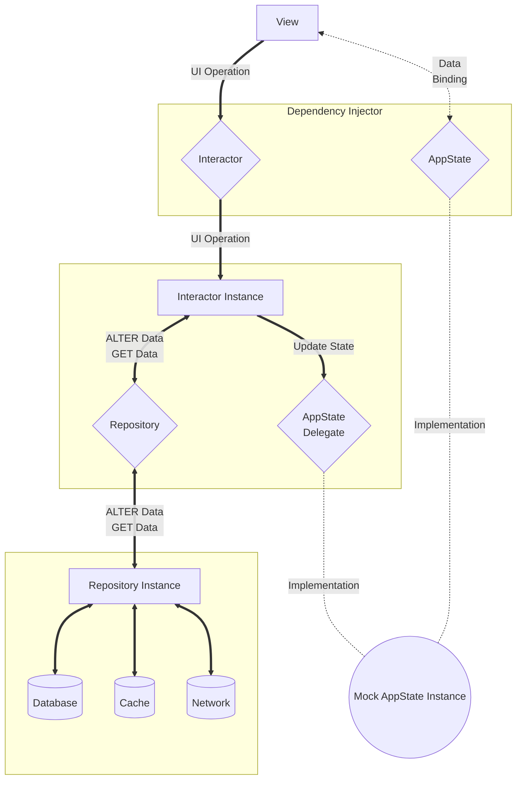
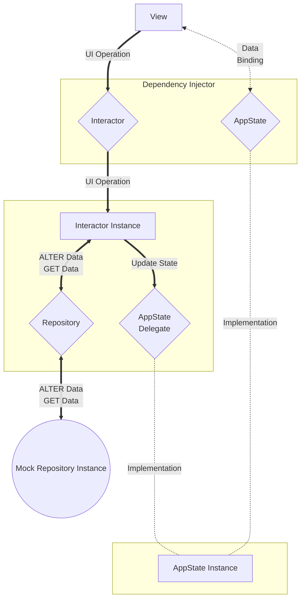
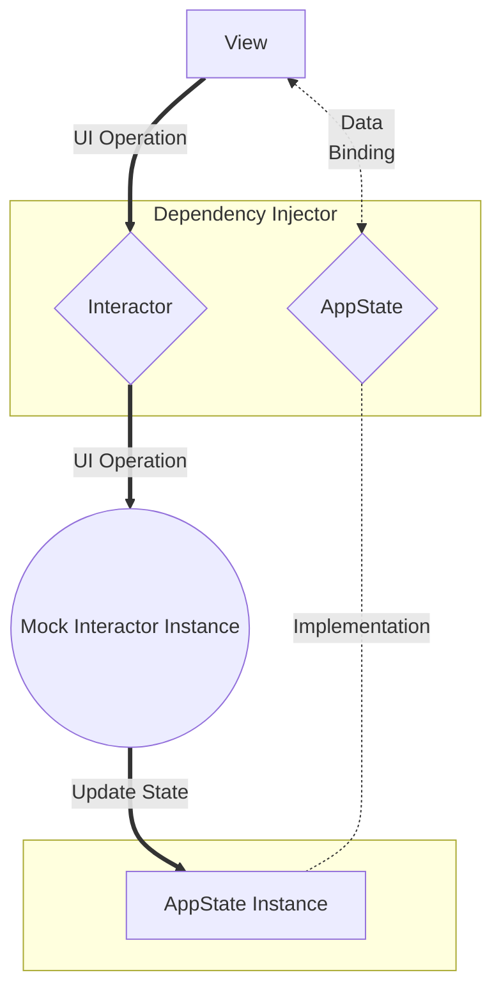

# SwiftUI Clean Architecture

A SwiftUI TodoList App implemented with clean architecture.

## Concept

- #### `View` 
    View represents SwiftUI view structure.
- #### `AppState` 
    `Stateful`</br>
    AppState stores the data status of the APP.
- #### `Interactor` 
    `Stateless`</br>
     Interactor handles the business logic.
- #### `Repository`
    Repository provides the persistence data using different sources.


## Directory Structure
> The node is a file when it has file extension.</br> 
> Otherwise, the node represents a directory.
```cpp
|
|__ UI  // SwiftUI Views
|
|__ Internal
        |
        |__ DependencyInjector
        |           |
        |           |__ Container.swift         // dependency injector instance
        |           |__ EnvironmentKey.swift    // environment key definition
        |
        |__ Entity      // Data Models
        |
        |__ Domain      // Interfaces
        |       |
        |       |__ AppState.swift              // AppState interface definition
        |       |__ Interactor.swift            // Interactor interface definition
        |       |__ Repository.swift            // Repository interface definition
        |
        |__ AppState    // AppState implementation
        |       |
        |       |__ Mock                        // AppState mocked instance
        |       |__ General                     // AppState general instance
        |
        |__ Interactor  // Interactor implementation
        |       |
        |       |__ Mock                        // Interactor mocked instance
        |       |__ General                     // Interactor general instance
        |
        |__ Repository  // Repository implementation
        |       |
        |       |__ Mock                        // Repository mocked instance
        |       |__ General                     // Repository general instance
        |
        |__ Util        // Utilities
```

## Architecture

### General
All component function


### Mock AppState
Implement AppState interface with mock instance


### Mock Repository
Implement Repository interface with mock instance



### Mock Interactor
Implement Interactor interface with mock instance

